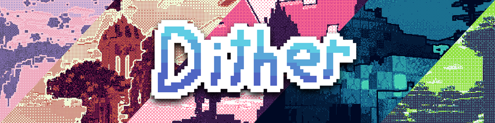

> [!IMPORTANT]
> Any Minecraft verions past 1.21.9 currently have a Iris issue which causes **inverted lightmaps**. You can still use the shader, but lighting might be off. This is not an issue with this project, but rather with Iris.

# Dither

Dither is a high-performance stylized shaderpack that aims to recreate hand-drawn pixel art graphics in minecraft. The pack is highly customizable and allows you to control almost every aspect of it. 

Including per pixel dithering, custom palette posterization (it will use only the colors in a palette to display minecraft), edge detection for sharp outlines, as well as crisp downsampling for a low resolution look.

## Using Custom Palettes

In order to use custom palettes, we need to edit the files a little bit. Once you have a copy of the shaderpack, it will likely be zipped. Unzip it (shaderpack will work zipped and unzipped), and locate the shaders folder. Inside, there should be a `palette.glsl` file. This is a small file that contains only the palette information. You do not need to touch any other files.

Color palettes typically come in hex format, and this will not work with shader code! I've made a tiny tool that allows you to convert your favorite palettes to fully working code which you can just paste into that `palette.glsl` file. So you simply need to open up the file with your available text editor, make your changes, and save it.  

https://snorfield.github.io/palette-to-shader/

After saving the file, make sure to **reload** the shaderpack. Alternatively if you don't wish to find your own palette, there's a text file named `palettes.txt` in the shaderpack from which you can copy some pre-generated palettes! 

## FQA

  
Does this work with Iris?

  
  Yes, this is written to be a fully Iris compatible shaderpack.

  
Does this work with Optifine?

  It might. I haven't proceeded with any testing on Optifine, so you're free to try it out and report the results in my discord server.

  
How do I edit settings?

  
  Navigate to your shader selection screen and click on "Shader Settings" for the options menu.

  
Why doesn't this work?

  
  - Check that you don't have any other visual modifications
  - Ensure your computer graphics drivers are up to date
  - Check that you are using a supported version of Minecraft
  - Make sure that you are using Iris
  - Try restarting Minecraft

  If the issue persists, open an issue on the github repository or join my discord server to report it. I will try to debug it as soon as possible.

  
Where can I find good palettes?

  [Lospec](https://lospec.com/) is a site that contains thousands of user-submitted palettes, it is what I use for all of my palette needs.

  
Where can I find the code?

  The github repository contains all the code for this shaderpack, it should be linked on the side.

  
This looks like trash!

  That's quite possible. It does take a lot of fine-tuning to get visually appealing images, which is why I've provided so many options to tweak.

  
It's too hard to change my palette!

  Unfortunately that's simply a limitation of Minecraft shaderpacks. I've made the process as simple as possible, even going so far as to write an entire web tool to quickly allow you to create compatible palette code. 

  I'll keep looking into it and update the shader if I ever find an easier solution.

